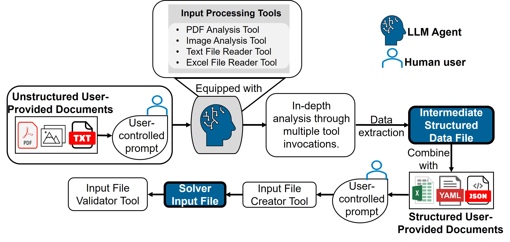
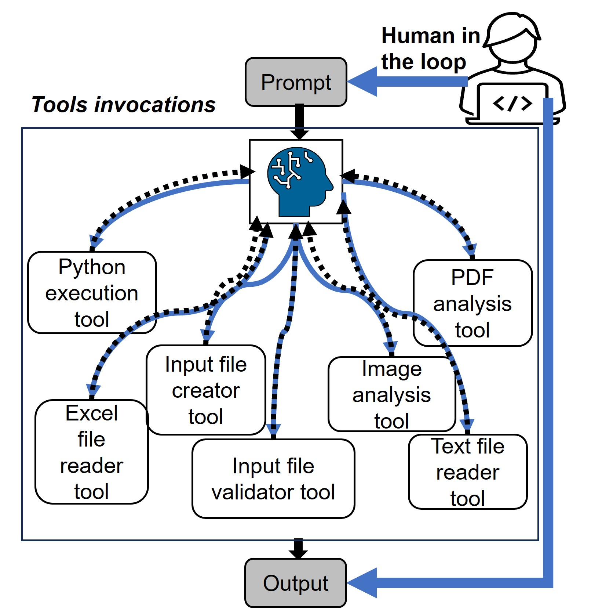
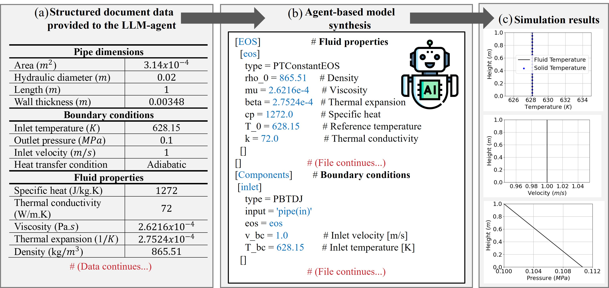
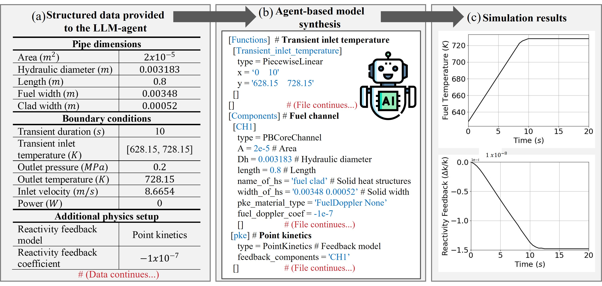
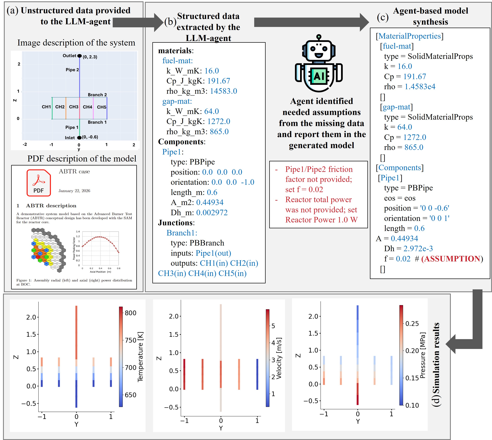
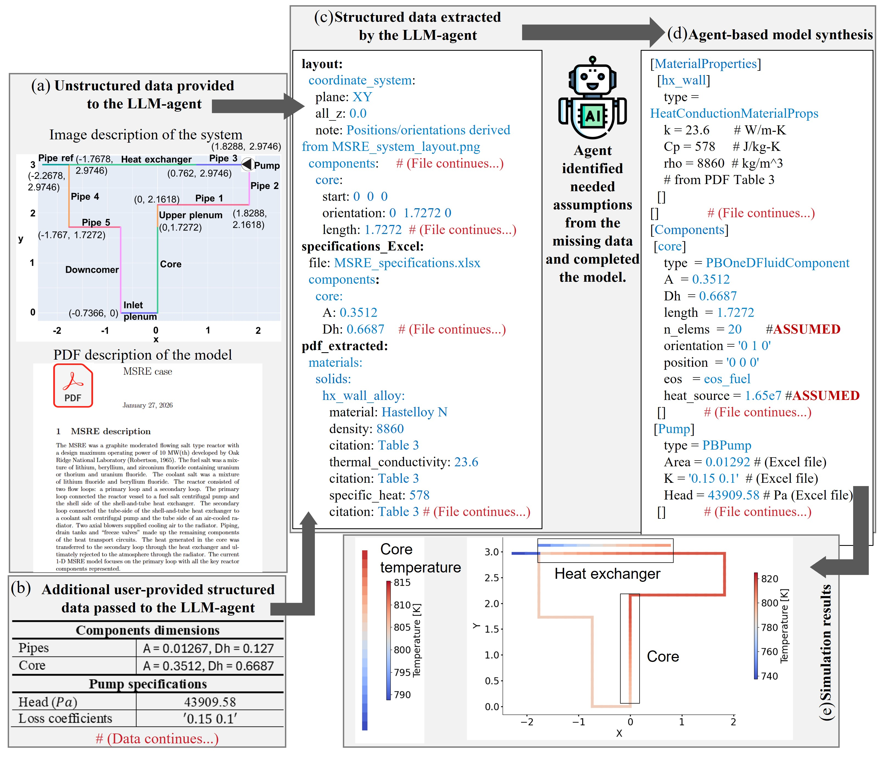

# AutoSAM

**An Agentic Framework for Automating Input File Generation for the SAM Code with Multi-Modal Retrieval-Augmented Generation**

Zaid Abulawi<sup>1,2</sup>, Zavier Ndum<sup>1,2</sup>, Eric Cervi<sup>2</sup>, Rui Hu<sup>2</sup>, Yang Liu<sup>1</sup>

<sup>1</sup> Department of Nuclear Engineering, Texas A&M University, College Station, TX, USA
<sup>2</sup> Nuclear Science and Engineering Division, Argonne National Laboratory, Lemont, IL, USA

---

This repository publishes the **methodology description, test cases, and evaluation record** for AutoSAM. It contains no source code — only the documents, prompts, intermediate representations, generated input decks, and raw evaluation data needed to inspect and reproduce the reported results.

## Overview

Constructing input files for system-level thermal-hydraulics codes such as the **System Analysis Module (SAM)** is a labor-intensive bottleneck in advanced-reactor design and safety analysis. Analysts must manually extract and reconcile design data scattered across heterogeneous engineering documents, then transcribe it into solver-specific syntax.

AutoSAM is an agentic framework that automates this process. It couples a large-language-model agent with retrieval-augmented generation (RAG) over SAM's user guide and theory manual, together with specialized tools for analyzing PDFs, images, spreadsheets, and text files. The agent ingests unstructured engineering documents — system diagrams, design reports, data tables — extracts simulation-relevant parameters into a **human-auditable intermediate representation**, and synthesizes a validated, solver-compatible input deck.

Two design choices are central to the framework:

- **A structured intermediate YAML file** sits between the raw documents and the final deck. It is not solver syntax; it is a modular, human-readable record of the extracted model, organized by component and parameter, with units normalized, ports and connections made explicit, and missing or assumed values flagged. This is the human-in-the-loop checkpoint where a domain expert verifies, edits, and augments the model before code generation.
- **An input-file validator** checks section presence and component connectivity, and reports specific defects back to the agent for repair.

Domain knowledge reaches the agent through two complementary channels: persistent **system instructions** curated from the solver user guide and theory manual, and **RAG** over the same corpus embedded in a vector store. Tool routing is dynamic — a LangChain tool-calling agent selects a tool at each iteration based on the request, rather than following a fixed sequence.

### Methodology



*The agent's tool chain for multi-modal document processing under a dynamic user prompt. Unstructured sources (images, PDFs) are parsed by specialized tools; extracted information is structured into an intermediate YAML representation; the reviewed intermediate file is combined with structured sources (Excel, JSON, YAML) and transformed into a SAM input file, which is then checked by the validator.*



*Seven tools in total: two content-parsing tools, two instruction-passing tools, two retrieval tools, and a Python code-execution tool.*

## Repository contents

| Path | Contents |
| --- | --- |
| [`figures/`](figures/) | Methodology and test-case figures from the manuscript |
| [`test_cases/`](test_cases/) | Per-case prompts, intermediate files, generated input decks, source documents, and simulation results |
| [`evaluation_results/`](evaluation_results/) | Raw evaluation data: scoring records, per-run responses, aggregates, and generation traces |

---

# Test cases

Four test cases of progressively increasing complexity. All were previously unseen by the agent. The first two rely exclusively on structured spreadsheet data and establish baseline capability; the third and fourth require extracting, interpreting, and reconciling information from multi-modal sources (PDF, image, spreadsheet) for realistic reactor configurations.

Full per-case artifacts — the **prompt**, the **intermediate file**, and the **input file** — are in [`test_cases/`](test_cases/).

## Test case 1 — Pipe model from a structured document



Steady-state simulation of a one-meter vertical sodium pipe with an adiabatic outer wall. Boundary conditions are a prescribed inlet velocity and temperature with a fixed outlet pressure, giving single-phase forced-convection flow.

Because the wall is adiabatic and no volumetric heating is applied, the energy balance implies an axially uniform temperature field: outlet bulk temperature equals inlet temperature, wall temperature equals fluid temperature everywhere, and pressure decreases monotonically along the flow direction from friction. These provide direct validation criteria. The agent produced a physically consistent model, applied the boundary conditions correctly, and preserved conservation behavior.

→ [`test_cases/01_pipe/`](test_cases/01_pipe/)

## Test case 2 — Solid-fuel temperature reactivity feedback



A single heated flow channel with concentric solid regions representing fuel and cladding, adding heat conduction in the solids and a temperature-dependent reactivity feedback model on top of the 1-D fluid equations. Internal volumetric power is zero, isolating the feedback mechanism.

A transient inlet boundary condition ramps the coolant temperature linearly from 628.15 K to 728.15 K over 10 s. With a negative feedback coefficient prescribed, the reactivity feedback should decrease smoothly and monotonically, with both fuel temperature and feedback approaching steady values after the ramp ends. The generated model reproduced this behavior, confirming the agent can integrate coupled multiphysics into the deck and define transient boundary conditions.

→ [`test_cases/02_pke/`](test_cases/02_pke/)

## Test case 3 — Advanced Burner Test Reactor (ABTR) core model



The first case requiring unstructured, multi-modal sources: a schematic image encoding system topology and a PDF containing boundary conditions, material properties, and operating parameters.

The modeled system is a simplified liquid-sodium flow path through an ABTR core. Sodium enters an upstream pipe, splits through a junction into five parallel vertical channels, then recombines through a second junction into an outlet pipe discharging to a fixed-pressure boundary. Inlet velocity and temperature are 3.25 m/s and 628 K; outlet pressure is 0.1 MPa. A total of 250 MW is distributed among the five channels, each with a simplified solid region enabling conjugate heat transfer.

Expected behavior gives three physics-based checks: uneven flow distribution among the five channels (branch hydraulic resistances differ), monotonic pressure decrease from friction and junction form losses, and coolant temperature rise through the heated channels.

**A documented retrieval failure and its correction.** During initial extraction, the RAG stage failed to retrieve the 250 MW reactor power stated in the source document, and the preliminary model used a default of 1 W. The agent **explicitly labeled this value as an assumption** and directed the user to verify it. The omission was caught during review of the intermediate representation and corrected before simulation. All reported results use the corrected model. This is the intended function of the intermediate-file checkpoint.

→ [`test_cases/03_abtr/`](test_cases/03_abtr/)

## Test case 4 — Molten Salt Reactor Experiment (MSRE) primary loop



A system-level circulating loop spanning core, plenums, pump, heat exchanger, and connecting piping, with information distributed across a layout image, a PDF, and user-provided structured data.

The primary loop runs through an inlet plenum, a heated core segment, an upper plenum, connecting pipes, a pump, and the primary side of a heat exchanger, returning through additional piping and a downcomer to close the loop. The secondary coolant-salt side is represented by inlet/outlet boundary conditions. A volumetric heat source in the core raises the primary-salt temperature; heat is removed in the exchanger.

Validation criteria: hottest temperatures near the core outlet, a measurable primary-side temperature drop across the heat exchanger, a secondary-side temperature rise, and a self-consistent loop temperature profile once transients decay.

→ [`test_cases/04_msre/`](test_cases/04_msre/)

---

# Evaluation

## Description

The evaluation is organized into five analyses that separate document-understanding performance from the engineering behavior of the generated models.

The analyses were performed on the **ABTR and MSRE cases**, the only two requiring unstructured multi-modal sources. Reference answers were curated by the authors and verified against the designated case documents. **Each analysis was repeated three times under fixed settings**, and results are reported as mean ± standard deviation to characterize run-to-run variability.

### 1. Visual information recovery

System schematics encode geometric and topological information not stated in the accompanying text — component adjacency, flow ordering, segment endpoint coordinates. Recovering it is a prerequisite for reconstructing system topology.

Two images were evaluated: the ABTR schematic (15 required visual facts) and the MSRE schematic (22). A *required fact* is any item of geometry, connectivity, or labeling needed to construct the model. Each image was analyzed in three runs using GPT-5.6 Sol at medium reasoning effort. Performance is quantified by **visual information recovery**:

$$\mathrm{ViR} = N_{\mathrm{recovered}} / N_{\mathrm{required}}$$

### 2. Retrieval-augmented generation (RAG)

This analysis isolates the retrieval stage from the rest of the pipeline, measuring whether the agent can find and correctly cite the right evidence when the corpus also contains closely related distractor documents.

**Question set.** Fifteen input-parameter questions per case (30 total), each repeated in three fixed-setting GPT-5.6 Sol runs at temperature zero with `text-embedding-3-large` embeddings. Representative ABTR questions ask for the fuel thermal conductivity and heat capacity, channel power fractions, channel hydraulic diameters, and junction form-loss coefficients. Representative MSRE questions ask for the fuel-salt density equation, coolant-salt viscosity, heat-exchanger wall density, secondary-side velocity boundary condition, and reactor core area.

**Corpora.** Each PDF page is stored as one retrieval chunk, and each corpus holds the authoritative target document together with related-document distractors:

| Case | Corpus pages | Target pages | Distractor pages | *k* | Corpus seen per question |
| --- | :---: | :---: | :---: | :---: | :---: |
| ABTR | 44 | 3 | 41 (related ABTR design report) | 2 | 4.5 % |
| MSRE | 71 | 6 | 65 (*Experience with the MSRE*, 20; NEAMS MSRE report, 45) | 10 | 14.1 % |

The retrieval depths differ deliberately. The ABTR source is compact, and preliminary sensitivity runs at *k* = 3 and *k* = 6 saturated — CoP, CiP, CiH, and evidence recall all 1.000 with HR 0.000 — so *k* = 2 was selected as the more discriminating setting, avoiding a ceiling effect and exposing failures caused by insufficient evidence retrieval. The required MSRE parameters are distributed across all six target pages and the distractors share closely related MSRE terminology, so *k* = 10 gives a moderate retrieval budget while still exposing only 14.1 % of the corpus per question. On average **74 % of the retrieved MSRE pages were distractors** (26.7 % for ABTR).

**Metrics**, adapted from prior work and computed over $Q$ evaluation questions.

*Evidence recall@k* evaluates the retrieval stage alone — the fraction of required evidence locations $\mathcal{E}_q$ recovered among the top-$k$ chunks, whose source locations are $\mathcal{T}^{(k)}_q$:

$$\mathrm{EvidenceRecall}@k = \frac{\sum_{q=1}^{Q}\left|\mathcal{E}_q \cap \mathcal{T}^{(k)}_q\right|}{\sum_{q=1}^{Q}\left|\mathcal{E}_q\right|}$$

*Context Precision* (CoP) is the fraction of atomic reference claims recovered with the correct meaning and numerical value, where $\mathcal{R}_q$ are the reference answers and $\mathcal{C}_q \subseteq \mathcal{R}_q$ those correctly recovered:

$$\mathrm{CoP} = \frac{\sum_{q=1}^{Q}\left|\mathcal{C}_q\right|}{\sum_{q=1}^{Q}\left|\mathcal{R}_q\right|}$$

*Citation precision* (CiP) is the fraction of generated citations $\mathcal{J}_q$ that support the associated answer claims, with $\mathcal{S}_q \subseteq \mathcal{J}_q$ the supporting ones:

$$\mathrm{CiP} = \frac{\sum_{q=1}^{Q}\left|\mathcal{S}_q\right|}{\sum_{q=1}^{Q}\left|\mathcal{J}_q\right|}$$

*Citation hit* (CiH) is the fraction of answers citing at least one required source location, with $\mathbb{I}[\cdot]$ the indicator function:

$$\mathrm{CiH} = \frac{1}{Q}\sum_{q=1}^{Q}\mathbb{I}\!\left[\mathcal{J}_q \cap \mathcal{E}_q \neq \varnothing\right]$$

*Hallucination rate* (HR) is the fraction of generated atomic claims $\mathcal{G}_q$ unsupported by the retrieved evidence, with $\mathcal{U}_q \subseteq \mathcal{G}_q$ the unsupported ones:

$$\mathrm{HR} = \frac{\sum_{q=1}^{Q}\left|\mathcal{U}_q\right|}{\sum_{q=1}^{Q}\left|\mathcal{G}_q\right|}$$

CoP penalizes omitted or incorrect reference claims, whereas HR measures unsupported generated content — so **an omission lowers CoP but is not counted as a hallucination**. By scoring convention, CiP or HR is set to zero when no citations or no claims are generated.

### 3. Parameter extraction

Each parameter in the reference answer is one scoring opportunity, allowing standard retrieval metrics:

- **TP** — a required parameter recovered with correct meaning and value
- **FP** — a generated parameter that is incorrect or unsupported by the designated sources
- **FN** — a required parameter omitted or recovered incorrectly

An incorrect value contributes both an FP and an FN; an omitted parameter contributes only an FN. This asymmetry reflects the greater consequence of a wrong value than of an evident omission in safety analysis.

Precision quantifies the reliability of the generated parameters:

$$\mathrm{Precision} = \frac{TP}{TP + FP}$$

Recall quantifies the fraction of required parameters recovered correctly:

$$\mathrm{Recall} = \frac{TP}{TP + FN}$$

The F1 score is the harmonic mean of the two:

$$\mathrm{F1} = 2\,\frac{\mathrm{Precision} \times \mathrm{Recall}}{\mathrm{Precision} + \mathrm{Recall}}$$

Three further metrics address requirements specific to engineering data.

*Unit accuracy* is the fraction of recovered numerical parameters carrying the correct physical unit, evaluated after conversion to a common representation:

$$\mathrm{UnitAccuracy} = \frac{N_{\mathrm{correct\ unit}}}{N_{\mathrm{recovered,\ numeric}}}$$

*Mean absolute relative error* (MRE) quantifies the deviation of the recovered numerical values from the reference, where $x_i$ and $\hat{x}_i$ are the reference and extracted values in compatible units:

$$\mathrm{MRE} = \frac{1}{N_{\mathrm{recovered,\ numeric}}}\sum_{i=1}^{N_{\mathrm{recovered,\ numeric}}}\frac{\left|\hat{x}_i - x_i\right|}{\left|x_i\right|}$$

Parameters that were not recovered are penalized through recall and excluded from the MRE, which therefore characterizes only the accuracy of the extracted subset.

*Assumption/hallucination rate* (AHR) is the fraction of generated parameter claims not supported by the designated sources. It counts both explicitly labeled assumptions and silently inferred values, since both are content unjustified by the source documents:

$$\mathrm{AHR} = \frac{N_{\mathrm{unsupported\ parameter\ claims}}}{N_{\mathrm{generated\ parameter\ claims}}}$$

Pooled ABTR–MSRE values are computed from combined parameter-level counts rather than by averaging case scores, so each case is weighted by its parameter count.

### 4. Comparison with manually developed models

Structural validity and parameter fidelity do not guarantee correct physical behavior. Generated models were therefore compared against equivalent models developed manually by an experienced analyst, using the quantities of interest that characterize the dominant system response. Agreement is reported as the percentage relative difference:

```math
\delta_y(\%) = 100 \cdot
\frac{\left|y_{\mathrm{AutoSAM}} - y_{\mathrm{manual}}\right|}
{\left|y_{\mathrm{manual}}\right|}
```

Because the manual models were developed independently, this comparison also surfaces component-level modeling simplifications adopted by the agent.

### 5. Ablation study

Test cases 3 and 4 were repeated using `gpt-5.2` with one pipeline stage disabled at a time:

- **LLM-only** — a single prompt containing all material properties, dimensions, boundary conditions, components, and connections from the reference model, with no retrieval, image processing, intermediate representation, or validator. Isolates the contribution of the solver-specific scaffolding.
- **No intermediate file** — extracted PDF text, spreadsheet data, and image-derived facts fed directly to input generation, requiring the model to reconcile heterogeneous records and emit SAM syntax in one step.
- **No validator** — connectivity and section-presence checks omitted, with connectivity defects seeded in each case. A subsequent **repair** configuration supplied the validator diagnosis to the agent, separating defect *detection* from defect *correction*.

Reported metrics: standard-section coverage across nine commonly used SAM sections, reference-component recall, parameter F1, and topology recall (the fraction of reference component connections reproduced). Section coverage measures presence only — the ABTR reference itself omits the optional `[Postprocessors]` section without becoming invalid, so coverage below unity does not necessarily indicate a defect.

## Results

### Visual information recovery

Three fixed-setting runs; pooled value weighted by number of required facts.

| Case | Required visual facts | ViR (mean ± SD) |
| --- | :---: | :---: |
| ABTR | 15 | 1.000 ± 0.000 |
| MSRE | 22 | 0.818 ± 0.079 |
| **Pooled** | **37** | **0.892 ± 0.047** |

The MSRE failures were omission of the inferred downcomer-top coordinate, and assignment of a length of 1.767 m to pipe 5 in place of the correct 1.0312 m.

Despite the relatively high pooled ViR, these failures indicate that **vision-based extraction alone is not sufficient** for constructing engineering models: a single incorrect coordinate, component length, or connection alters the resulting SAM topology or geometry. This supports using a model-building tool that associates each component with structured SAM-specific metadata (component type, geometry, ports, connectivity, boundary conditions). The schematics used here were generated with such a tool, and the underlying metadata were deliberately withheld from AutoSAM to evaluate image-only interpretation. In a deployed workflow the structured metadata would be supplied directly, and visual interpretation would serve as complementary verification rather than as the sole source of model information.

### Retrieval-augmented generation

Performance under related-document noise; mean ± SD over three runs.

| Case | *k* | Evidence recall@*k* | CoP | CiP | CiH | HR |
| --- | :---: | :---: | :---: | :---: | :---: | :---: |
| ABTR | 2 | 0.938 ± 0.000 | 0.946 ± 0.000 | 0.933 ± 0.000 | 0.933 ± 0.000 | 0.035 ± 0.000 |
| MSRE | 10 | 0.933 ± 0.000 | 0.889 ± 0.000 | 0.974 ± 0.044 | 0.800 ± 0.000 | 0.000 ± 0.000 |
| **Pooled** | — | **0.935 ± 0.000** | **0.922 ± 0.000** | **0.951 ± 0.020** | **0.867 ± 0.000** | **0.024 ± 0.000** |

Evidence recall is similar across the two retrieval settings — 0.938 for ABTR at *k* = 2 and 0.933 for MSRE at *k* = 10 — despite ABTR seeing only 4.5 % of its corpus per question. ABTR achieved higher answer correctness and citation-hit performance; MSRE produced slightly higher citation precision and **no unsupported generated claims**. In both cases the noise citation rate was 0.000: the agent never cited a distractor document, even though 74 % of the pages retrieved for MSRE came from one.

The small standard deviations primarily reflect repeatability under fixed experimental conditions rather than a claim of general stability. The vector store, embeddings, questions, retrieval rankings, prompts, and model settings were all held constant, and answer generation used temperature zero, so nearly identical evidence and responses were produced across the three runs.

### Parameter extraction

Averaged over three fixed-setting runs.

| Case | Precision | Recall | F1 | Unit accuracy | Mean relative error | Assumption/HR |
| --- | :---: | :---: | :---: | :---: | :---: | :---: |
| ABTR | 0.946 | 0.946 | 0.946 | 1.000 | 0.269 | 0.035 |
| MSRE | 1.000 | 0.889 | 0.941 | 1.000 | 0.000 | 0.000 |
| **Pooled** | **0.967** | **0.922** | **0.944** | **1.000** | **0.109** | **0.024** |

The two cases failed in different ways:

- **ABTR** — retrieval did not return the fuel-property page, and the agent substituted cladding thermal conductivity and heat capacity for the corresponding fuel properties. This accounts for the mean relative error of 0.269 and the AHR of 0.035.
- **MSRE** — an ingestion error occurred during conversion of a dense multi-column table into stored page text. The original PDF contains the complete table, but the transcription did not retain its full content. The core flow area (0.3512 m²), downcomer hydraulic diameter (0.0508 m), and core length (1.7272 m) were consequently absent from the vector store and unrecoverable by retrieval. These are **ingestion-related false negatives**, not answer-generation errors or inferred replacements — consistent with MSRE precision of 1.000 and AHR of 0.000.

### Comparison with manually developed models

Final recorded simulation outputs.

| Case | Output quantity | Manual | AutoSAM | Relative difference |
| --- | --- | ---: | ---: | ---: |
| Pipe | Outlet fluid temperature (K) | 628.15 | 628.15 | 9.6×10⁻¹¹ % |
| PKE | Total reactivity feedback | −1.4772807857593×10⁻⁸ | −1.4772807857850×10⁻⁸ | 1.7×10⁻⁹ % |
| ABTR | Core inlet temperature (K) | 636.769 | 628.150 | 1.353 % |
| ABTR | Core outlet temperature (K) | 792.269 | 783.679 | 1.084 % |
| ABTR | Core temperature rise (K) | 155.500 | 155.529 | 0.019 % |
| ABTR | Total core mass flow (kg/s) | 1265.066 | 1263.951 | 0.088 % |
| MSRE | Core temperature rise (K) | 29.799 | 26.459 | 11.207 % |
| MSRE | Core pressure drop (kPa) | 37.044 | 35.597 | 3.909 % |
| MSRE | Primary HX temperature drop (K) | 29.813 | 27.345 | 8.278 % |
| MSRE | Primary mass flow (kg/s) | 167.906 | 189.178 | 12.669 % |
| MSRE | Pump head (kPa) | 43.910 | 43.910 | 0.000 % |

Pipe and PKE agree to within numerical precision. ABTR agrees closely overall — core temperature rise and total core mass flow differ by less than 0.1 %, inlet and outlet temperatures by roughly 1 %.

MSRE shows larger discrepancies, principally in primary mass flow (12.669 %), core temperature rise (11.207 %), and primary heat-exchanger temperature drop (8.278 %). These stem from the **heat-exchanger approximation**: the manual case represents the U-tube exchanger using three fluid segments and two coupled wall structures, whereas AutoSAM approximates it as a single component. The two MSRE models are therefore not physically identical, which changes hydraulic resistance, primary flow, and heat-transfer response.

### Ablation study

GPT-5.2. Standard sections denotes presence of nine benchmarked top-level SAM sections. Ablated configurations are mean ± SD over three runs; full-pipeline artifacts are single references.

| Configuration | Case | Standard sections | Component recall | Parameter F1 | Topology recall |
| --- | --- | :---: | :---: | :---: | :---: |
| Full pipeline | ABTR | 0.889 | 1.000 | 1.000 | 1.000 |
| | MSRE | 1.000 | 1.000 | 1.000 | 1.000 |
| LLM only | ABTR | 0.556 ± 0.000 | 1.000 ± 0.000 | 1.000 ± 0.000 | 1.000 ± 0.000 |
| | MSRE | 0.556 ± 0.000 | 1.000 ± 0.000 | 1.000 ± 0.000 | 1.000 ± 0.000 |
| No intermediate file | ABTR | 1.000 ± 0.000 | 0.917 ± 0.000 | 0.591 ± 0.085 | 0.000 ± 0.000 |
| | MSRE | 1.000 ± 0.000 | 0.431 ± 0.400 | 0.393 ± 0.330 | 0.000 ± 0.000 |
| No validator | ABTR | 0.889 ± 0.000 | 1.000 ± 0.000 | 1.000 ± 0.000 | 0.900 ± 0.000 |
| | MSRE | 1.000 ± 0.000 | 0.958 ± 0.000 | 0.990 ± 0.000 | 0.909 ± 0.000 |

**LLM only.** The prompt supplied all reference material properties, dimensions, boundary conditions, components, and connections, so the baseline preserved the supplied parameters and topology. In every run, however, it generated only five sections — `GlobalParams`, `EOS`, `MaterialProperties`, `Components`, `Executioner` — omitting `Functions`, `Preconditioning`, `Postprocessors`, and `Outputs`. The prompt provided complete engineering data but not the solver-specific section scaffold that AutoSAM supplies. SAM's licensed, closed-source nature additionally limits the availability of public example decks in general-purpose training corpora. This demonstrates the importance of solver-specific instructions and templates for assembling a complete SAM input structure, though it does not establish the closed-source nature of SAM as the sole cause of the omissions.

**No intermediate file.** Removing the intermediate representation degraded the *content* of the generated sections even though all nine headings were present. Parameter F1 fell to 0.591 ± 0.085 (ABTR) and 0.393 ± 0.330 (MSRE), and topology recall was **zero** in both cases. Without it, the model had to identify, reconcile, and transfer material properties, geometry, units, component names, boundary conditions, and connections directly from heterogeneous source records while simultaneously generating SAM syntax — increasing parameter omissions and component-name inconsistencies, and eliminating explicit connections. The intermediate representation reduces this burden by organizing extracted information by component and parameter, normalizing units and names, representing ports and connections explicitly, and identifying missing or assumed values before generation. It also provides the analyst-review checkpoint at which incomplete or conflicting information can be corrected.

**No validator.** For ABTR, removing the connection between the distribution branch and a single channel left nine of ten reference edges (topology recall 0.900). For MSRE, removing one complete pipe-junction block left ten of eleven reference edges (0.909); because that block also carried component and parameter information, component recall and parameter F1 decreased accordingly. **In neither case did the agent identify or correct the seeded defect without validator feedback.** When the validator reported the specific missing connection to the repair prompt, the agent corrected **all six seeded defects** (two cases × three runs). The validator is therefore necessary both for detecting connectivity errors and for communicating them to the agent.

### Generation cost and runtime

One AutoSAM generation per case.

| Case | Input tokens | Output tokens | Time (min) | Cost (USD) |
| --- | ---: | ---: | ---: | ---: |
| Pipe | 1,631,514 | 13,673 | 2.56 | 0.91 |
| PKE | 1,396,870 | 15,337 | 2.65 | 0.63 |
| ABTR | 1,837,583 | 27,822 | 4.87 | 0.94 |
| MSRE | 1,397,468 | 29,470 | 5.83 | 0.87 |

Input tokens ranged from ~1.40 to 1.84 million, output tokens from 13,673 to 29,470. Runtime rose from 2.56 min (Pipe) to 5.83 min (MSRE). Estimated cost stayed **below $1 per case**. The large input-token counts are cumulative across the agent's successive tool calls, during which system instructions, tool definitions, conversation history, and intermediate results are all re-included in the model context.

### Representative parameter provenance

The table below presents a manually audited provenance record for representative parameters defining the ABTR and MSRE models. For each parameter, it records the extracted or adopted value and unit, the source and extraction method, and the resulting evidence or review status.

The provenance record distinguishes values that were directly source-backed from those missed during retrieval, supplied from another structured source, introduced as explicit modeling assumptions, or provided during analyst review. It also records the principal RAG and ingestion failures and how affected inputs were recovered before final SAM input generation. This audit trail complements the aggregate extraction metrics by making individual parameter-level decisions, uncertainties, and corrections inspectable.

*Representative, manually audited parameter provenance. PDF page numbers refer to the designated case PDFs.*

| Case | Parameter | Value and unit | Source / extraction method | Evidence / review status |
| --- | --- | --- | --- | --- |
| ABTR | Fuel properties | Thermal conductivity, k: 16 W/(m·K); heat capacity, cp: 191.67 J/(kg·K); density, rho: 14,583 kg/m³ | PDF p. 1; RAG | Source-backed; reference-checked |
| ABTR | Channel geometry and power split | Length, L: 0.8 m; hydraulic diameter, Dh: 0.002972 m; channel power fractions: (0.02248, 0.41924, 0.09852, 0.43116, 0.02860) | PDF p. 2; RAG | Source-backed; reference-checked |
| ABTR | Total reactor power | 250 MW | Reference deck; analyst supplied | Supplied during review; replaces the preliminary 1 W draft placeholder |
| ABTR | Radial heat-structure mesh | CH1–CH4: (2, 1, 1) elements; CH5: (2, 1) elements | No source; generation assumption | Explicit modeling assumption; analyst approval required |
| MSRE | Fuel-salt density | rho = 2553.3 − 0.562 × T kg/m³, where T is in K | PDF p. 1; RAG | Source-backed; reference-checked |
| MSRE | Secondary-salt viscosity | mu = 1.16 × 10⁻⁴ × exp(3755/T) Pa·s | PDF p. 2; RAG | Source-backed; reference-checked |
| MSRE | Core/downcomer geometry | Core flow area, A: 0.3512 m²; downcomer hydraulic diameter, Dh: 0.0508 m; core length, L: 1.7272 m | PDF p. 4 retrieval miss; spreadsheet/direct structured source | Supplied from a structured source; checked against the reference |
| MSRE | Secondary boundary conditions | Inlet velocity, vin: 1.6 m/s; outlet pressure, pout: 100,000 Pa | PDF p. 5; RAG | Source-backed; reference-checked |
#### Interpretation

- The ABTR reactor-power omission illustrates the role of the intermediate representation as a human-review checkpoint: the preliminary 1 W value was explicitly labeled as an assumption, identified during review, and replaced with the source-supported 250 MW value before final simulation.
- The ABTR radial heat-structure meshes were not specified in the designated case material. They are therefore documented as generation assumptions rather than presented as retrieved engineering facts.
- The MSRE core flow area, downcomer hydraulic diameter, and core length were absent from the vector store because dense multi-column PDF-table content was incompletely retained during ingestion. These values could not have been recovered by RAG from that store; they were instead supplied from the structured source and checked before final input generation.
- A provenance record makes omissions, substitutions, structured-source supplements, and analyst interventions visible at the parameter level. This is particularly important for safety-relevant engineering workflows, where a plausible numerical value is not equivalent to a traceable, approved input.
---

## Citation

If you use this material, please cite:

> Z. Abulawi, Z. Ndum, E. Cervi, R. Hu, Y. Liu. *AutoSAM: an Agentic Framework for Automating Input File Generation for the SAM Code with Multi-Modal Retrieval-Augmented Generation.*

## Acknowledgment

The submitted manuscript has been co-created by UChicago Argonne, LLC, Operator of Argonne National Laboratory ("Argonne"). Argonne, a U.S. Department of Energy Office of Science laboratory, is operated under Contract No. DE-AC02-06CH11357. The U.S. Government retains for itself, and others acting on its behalf, a paid-up nonexclusive, irrevocable worldwide license in said article to reproduce, prepare derivative works, distribute copies to the public, and perform publicly and display publicly, by or on behalf of the Government.

Authors Zaid Abulawi, Zavier Ndum Ndum, and Yang Liu are partially supported by the U.S. Department of Energy Office of Nuclear Energy Distinguished Early Career Program under contract number DE-NE0009468.
